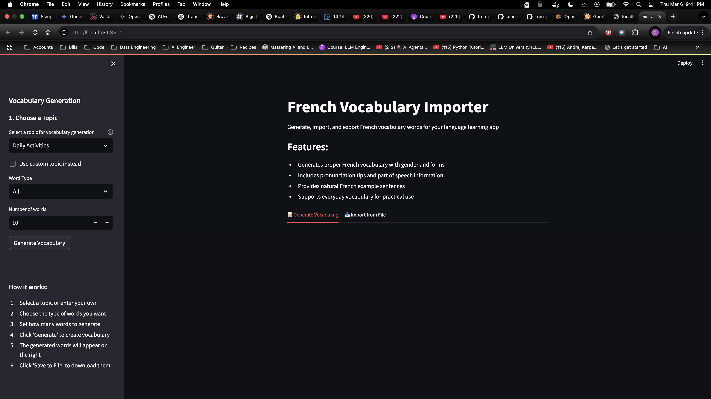
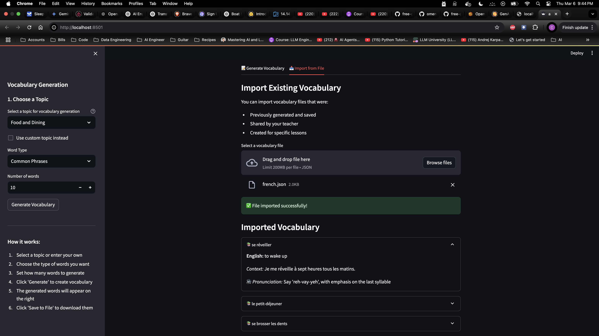
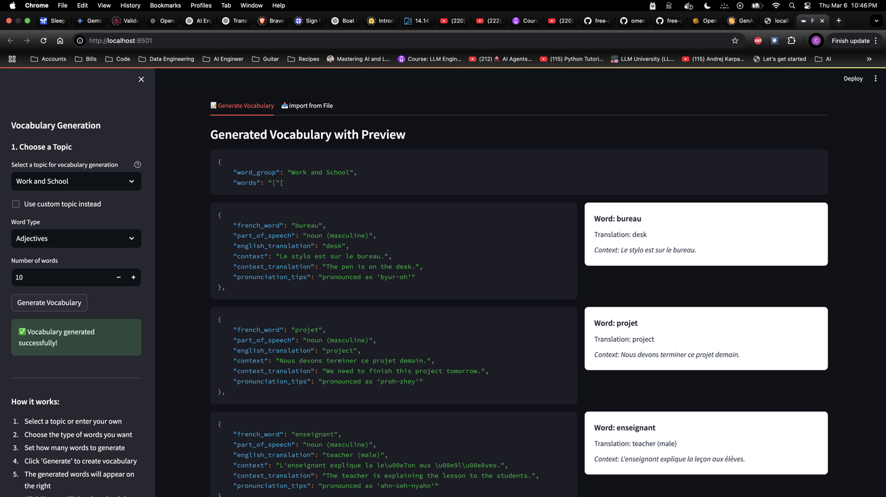

# French Vocabulary Importer Tool

## Purpose

This tool is part of the French Vocabulary Builder project, designed to help teachers and content creators generate high-quality French vocabulary content for their students. It uses OpenAI's GPT model to create contextually relevant vocabulary with proper French forms, pronunciations, and authentic usage examples.

## Workflow

1. **Content Creation (Teachers/Educators)**:

   - Use this tool to generate French vocabulary for specific topics
   - Review and edit the generated content
   - Save vocabulary as JSON files
   - Share files with students or import into the main application

2. **Content Consumption (Students)**:

   - Students use the main French Vocabulary Builder application
   - They study vocabulary prepared by their teachers
   - They don't need to interact with this tool directly

3. **Data Flow**:
   ```
   [Vocab Importer Tool]
         ↓
   Creates .json files
         ↓
   [Main Application]
         ↓
   Students study vocabulary
   ```

## Problems and Solutions

1. **OpenAI API Versioning**:

   - Issue: Compatibility problems between different versions of the OpenAI package
   - Solution: Downgraded to openai==0.28.1 for stable functionality

2. **Environment Variables**:

   - Issue: Tool needed access to OpenAI API key
   - Solution: Uses parent directory's .env file for consistent configuration

3. **User Experience**:

   - Issue: Initial interface was too technical for non-technical users
   - Solution: Added intuitive UI with previews, explanations, and guided workflow

4. **JSON Response Formatting**:
   - Issue: OpenAI responses occasionally contained malformed JSON with unterminated strings or missing braces
   - Solution:
     - Added a system prompt to enforce proper JSON formatting
     - Implemented automatic retry system (up to 3 attempts)
     - Enhanced error handling and user feedback
     - Increased max_tokens to handle larger responses
     - Added content cleaning before JSON parsing

## Tools and Technologies

- **Streamlit**: For creating the interactive web interface
- **OpenAI API**: Powers the vocabulary generation
- **Python**: Core programming language
- **JSON**: Data storage format
- **Python-dotenv**: Environment variable management

## Project Structure

```
vocab_importer/
├── app.py              # Main Streamlit application
├── requirements.txt    # Python dependencies
├── README.md          # Documentation
├── docs/              # Documentation assets
│   └── screenshots/   # Application screenshots
└── sample_data/       # Example vocabulary files
```

## Screenshots

### 1. Main Interface


_The main interface shows the topic selection, word type options, and number of words to generate._

### 2. Generated Vocabulary Preview


_Side-by-side view of the generated JSON and how it will appear in the main application._

### 3. Import Functionality


_The import interface allows reviewing and importing existing vocabulary files._

## Features

- Generate French vocabulary with proper forms:
  - Nouns: Include gender (masculine/feminine)
  - Verbs: Present tense and infinitive forms
  - Adjectives: Masculine and feminine forms
- Includes pronunciation tips
- Provides authentic French example sentences
- Real-time preview of how vocabulary will appear in the main application
- Import/Export functionality for vocabulary management

## Setup and Installation

1. Ensure you're in the project directory:

   ```bash
   cd lang-portal/vocab_importer
   ```

2. Create and activate a virtual environment:

   ```bash
   python3 -m venv venv
   source venv/bin/activate  # On Windows: .\venv\Scripts\activate
   ```

3. Install dependencies:

   ```bash
   pip install -r requirements.txt
   ```

4. Verify the OpenAI API key is set in the parent directory's `.env` file:

   ```
   OPENAI_API_KEY=your_api_key_here
   ```

5. Run the application:
   ```bash
   streamlit run app.py
   ```

## Usage Tips

1. **Generating Vocabulary**:

   - Choose a predefined topic or create a custom one
   - Select the type of words you need
   - Adjust the number of words to generate
   - Review the preview to see how it will look for students

2. **Saving and Sharing**:

   - Use the 'Save to File' button to export vocabulary
   - Files are saved in JSON format
   - Share the files with students or import them into the main application

3. **Importing Existing Content**:
   - Use the Import tab to review existing vocabulary files
   - Verify the content before sharing with students
   - Make any necessary adjustments to the vocabulary

## Features

- Generate French vocabulary with proper forms:
  - Nouns: Include gender (masculine/feminine)
  - Verbs: Present tense and infinitive forms
  - Adjectives: Masculine and feminine forms
- Include part of speech information
- Provide authentic French example sentences with translations
- Include pronunciation audio URLs (integration with text-to-speech)
- Export generated vocabulary to JSON files
- Import existing vocabulary from JSON files
- Filter by word types (Nouns, Verbs, Adjectives, etc.)
- Customizable number of words and topics

## Usage

1. Enter a French-related topic (e.g., "Family Terms", "Daily Activities", "Food and Dining")
2. Select the desired word type (Nouns, Verbs, Adjectives, etc.)
3. Choose the number of words to generate
4. Click "Generate Vocabulary" to create new Latin vocab words
5. Review the generated vocabulary, including:
   - Word forms and grammatical information
   - English definitions
   - Classical Latin example sentences
   - English translations
6. Use the Export button to save to JSON
7. Use the Import tab to load existing vocabulary files
