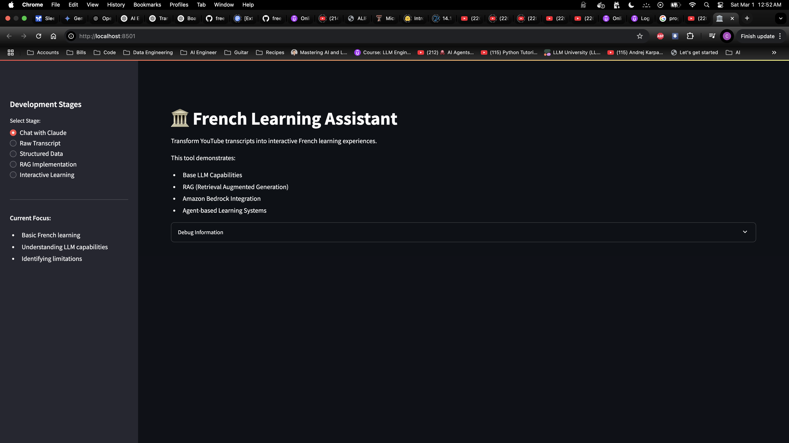
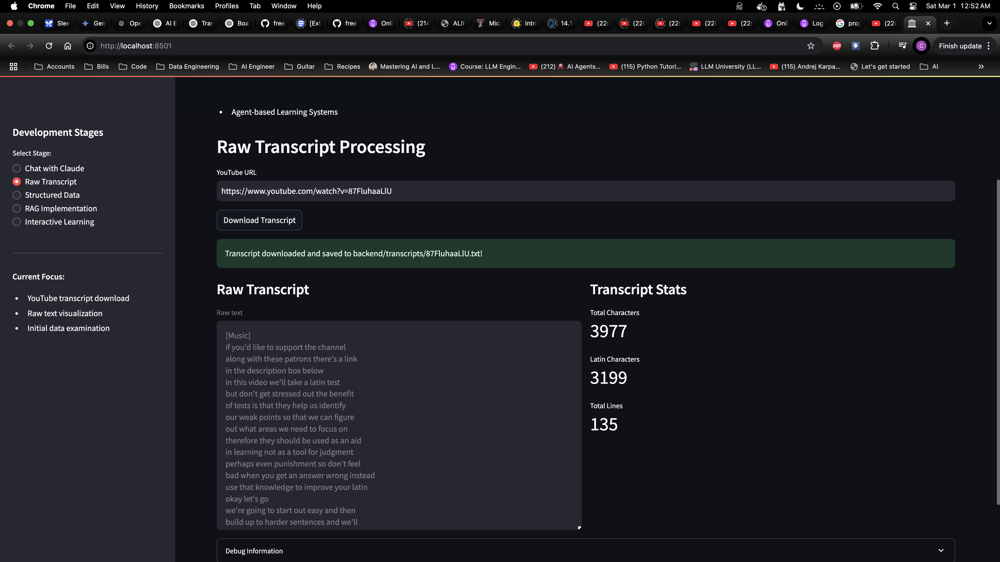
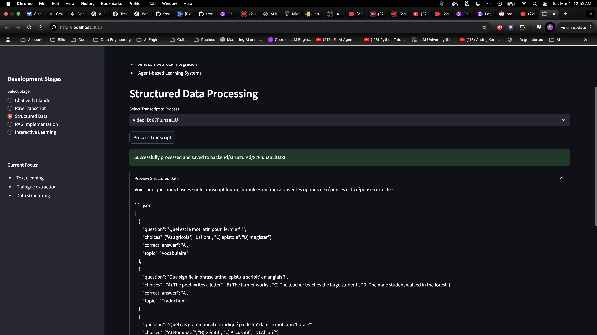
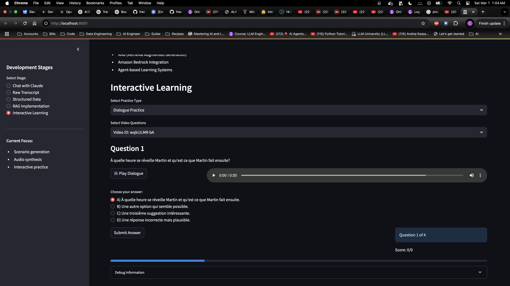
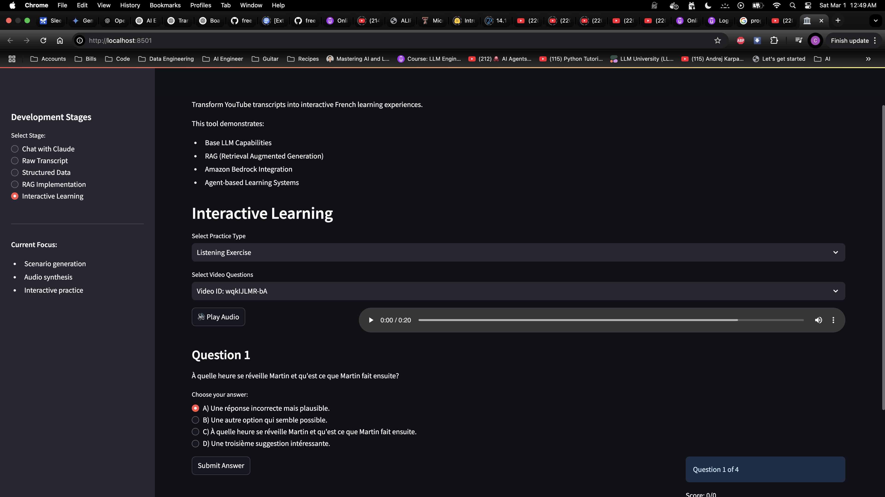

# French Learning Assistant

## Objective

- Create an interactive French learning application that focuses on listening comprehension
- Generate natural-sounding conversations from YouTube transcripts
- Provide audio-based quizzes with alternating male/female voices

## Screenshots

### 1. Main Interface

_Wide layout interface optimized for desktop viewing_

### 2. Raw Transcript View

_Full-height display with no scrolling required_

### 3. Structured Data View

_Clear visual separation between content sections_

### 4. Interactive Learning (1)

_Wide layout (max-w-6xl) prevents text wrapping_

### 5. Interactive Learning (2)

_1.25rem padding maintains readability_

## Tools Used

- **Frontend**: Streamlit
- **Audio Generation**: Amazon Polly (Neural TTS)
- **AI Services**:
  - Amazon Bedrock (Claude) for conversation generation
  - LangChain for RAG implementation
- **Data Processing**: ffmpeg for audio manipulation

## Key Features

- YouTube transcript extraction and processing
- Dynamic quiz generation from processed content
- Multi-voice audio generation with natural pacing
- RAG-based contextual responses

## Current Concerns

- Audio generation speed needs optimization
- Memory management for audio file cleanup
- AWS credentials handling in development vs production
- Port conflicts when running multiple Streamlit instances

## Problems Encountered & Solutions

1. **Audio Generation Issues**

   - Problem: Inconsistent voice timing and unclear answer choices
   - Solution: Implemented SSML tags for better pacing and clear option markers

2. **Voice Alternation**

   - Problem: Single voice made long sessions monotonous
   - Solution: Added alternating male/female voices with consistent patterns

3. **Resource Management**
   - Problem: Accumulated temporary audio files
   - Solution: Implemented automatic cleanup on question navigation

## Setup Requirements

- Python 3.8+
- AWS credentials with Polly and Bedrock access
- ffmpeg installed locally
- Environment variables configured in `.env`

## Key Differences from Original Project

### Architecture & Framework Enhancements

- **LangChain Integration**: Added LangChain for sophisticated RAG implementation, enabling better context management
- **Single Application**: Unified frontend and backend into a single Streamlit application (original had separate backend)
- **Advanced Audio Processing**: Implemented SSML and voice alternation for better audio quality

### Feature Additions

- **Voice Alternation**: Added male/female voice switching for more engaging audio
- **RAG Implementation**: Added contextual learning with RAG-based responses
- **Memory Management**: Added automatic cleanup of audio files
- **Enhanced Error Handling**: Added comprehensive error tracking and user feedback

### Technical Improvements

- **AWS Integration**: Deeper integration with AWS services (Polly, Bedrock)
- **State Management**: Better session state handling in Streamlit
- **Code Organization**: More modular code structure with separate audio generation class
