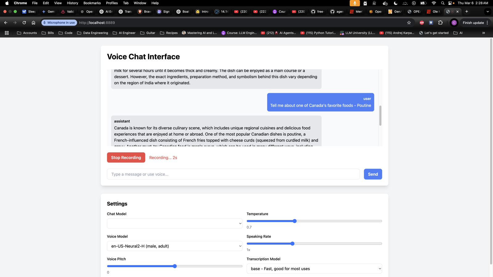

# My OPEA Microservices Implementation

A focused implementation of the OPEA (Open Enterprise AI) architecture patterns, designed to support my French vocabulary learning project.

## What is OPEA?

OPEA (Open Enterprise AI) is an open-source architectural framework for building enterprise-grade AI applications. Key aspects include:

1. **Microservices Architecture**
   - Modular, independently deployable services
   - Clear separation of concerns
   - Scalable and maintainable design

2. **AI-First Design**
   - Built around AI/ML model integration
   - Standardized interfaces for AI services
   - Flexible model deployment strategies

3. **Enterprise Features**
   - High availability and fault tolerance
   - Monitoring and observability
   - Security and access control

## How We Use OPEA

In this implementation, OPEA principles guide our architecture in several ways:

1. **Service Organization**
   - Chat service as a standalone microservice
   - Database service for persistent storage
   - Clear API boundaries between components

2. **AI Integration**
   - Ollama for local LLM deployment
   - Standardized chat completion endpoints
   - WebSocket support for real-time AI interactions

3. **Enterprise Patterns**
   - Docker containerization for deployment
   - Health checks and monitoring
   - PostgreSQL for reliable data persistence

## Implementation Progress

1. **French Vocabulary Integration**
   - Vocabulary Display Format:
     * Three-line format for each item:
       ```
       Word: [French word]
       Translation: [English translation]
       Context: [Usage example in italics]
       ```
     * Clear visual separation (1.25rem padding, 1rem margin)
     * Wide layout (max-w-6xl) prevents text wrapping
   - Chat Interface:
     * Real-time conversation via WebSocket
     * Full-height display with no scrolling
     * Desktop-optimized for readability

2. **OPEA Architecture Progress**
   - Core Components:
     * Chat microservice with Ollama integration
     * PostgreSQL for vocabulary and chat history
     * Health check endpoints for monitoring
   - Current Limitations:
     * Using Tiny Llama (memory constraints)
     * Single service implementation
     * Basic error handling

3. **Technical Achievements**
   - Successfully Implemented:
     * Docker containerization
     * WebSocket real-time updates
     * Database persistence
   - Resolved Challenges:
     * Service discovery between containers
     * Database connection management
     * Model deployment optimization

4. **Vocabulary Learning Focus**
   - AI Features:
     * Context-aware translations
     * Usage examples generation
     * Real-time corrections
   - Future Enhancements:
     * Pronunciation assistance
     * Progress tracking
     * Vocabulary grouping

## Key Differences from Instructor's Version

I took a more streamlined approach compared to the instructor's implementation:

1. **Simplified Architecture**

   - Single chat service instead of multiple TTS services
   - Focused on core functionality needed for vocabulary learning
   - Integrated PostgreSQL for persistent chat history

2. **Technology Choices**
   - Using Ollama for LLM capabilities instead of VLLM
   - Simplified Docker setup with fewer services
   - FastAPI for both HTTP and WebSocket endpoints

## Screenshots

### 1. Main Interface



## User Interface and Interaction

1. **Chat Interface**

   - Clean, wide layout to maximize readability
   - No scrolling in content sections - displays at full height
   - Clear visual separation between chat messages
   - Real-time message updates via WebSocket

2. **Vocabulary Display**
   - Three-line format for each vocabulary item:
     ```
     Word: [French word]
     Translation: [English translation]
     Context: [Usage example in italics]
     ```
   - Wide layout (max-w-6xl) prevents text wrapping
   - 1.25rem padding and 1rem margin between items
   - Desktop-focused design for optimal readability

## Challenges Encountered

1. **Model Limitations**

   - Had to use Tiny Llama due to memory constraints on local machine
   - Larger models would have provided better accuracy but required more resources
   - Encountered accuracy issues: model confused actor John Candy with George Costanza from Seinfeld
   - Need to implement better fact-checking or use a more reliable model

2. **Docker Integration**

   - Initial issues with service discovery between containers
   - Needed to adjust port mappings to avoid conflicts
   - Learning curve with Docker networking concepts

3. **Database Integration**
   - Setting up proper PostgreSQL connection strings
   - Managing database migrations and schema
   - Ensuring data persistence across container restarts

## Tools and Technologies Used

- **Core Stack**:

  - `FastAPI`: Web framework and WebSocket support
  - `Ollama`: Local LLM hosting
  - `PostgreSQL`: Data persistence
  - `Docker & Docker Compose`: Containerization

- **Development Tools**:
  - `Python 3.11`
  - `pip` for dependency management
  - `psycopg2` for PostgreSQL interaction
  - `websockets` for real-time communication

## Application to Vocabulary Project

This microservices architecture will enhance my French vocabulary builder by:

1. **Scalability**

   - Easy integration of new AI models
   - Separate concerns for chat and future audio features
   - Flexible deployment options

2. **Future Features**
   - Text-to-speech for pronunciation practice
   - Chat history for tracking learning progress
   - Real-time interaction for vocabulary exercises

## Setup and Usage

1. Install prerequisites:

   - Docker and Docker Compose
   - Python 3.11+

2. Start the services:

```bash
export LLM_MODEL_ID=llama2:7b
docker compose up
```

## API Endpoints

- `POST /v1/chat/completions`: Chat completions endpoint
- `WS /ws/chat`: WebSocket for real-time chat
- `GET /health`: Service health check

## Development

1. Set up local environment:

```bash
python -m venv venv
source venv/bin/activate
pip install -r requirements.txt
```

2. Run locally:

```bash
python -m app.main
```
